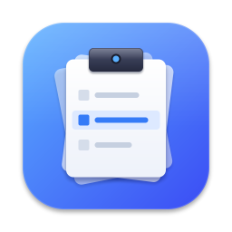
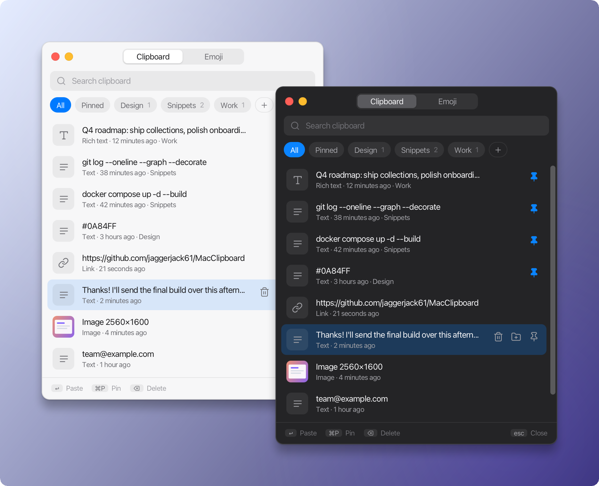
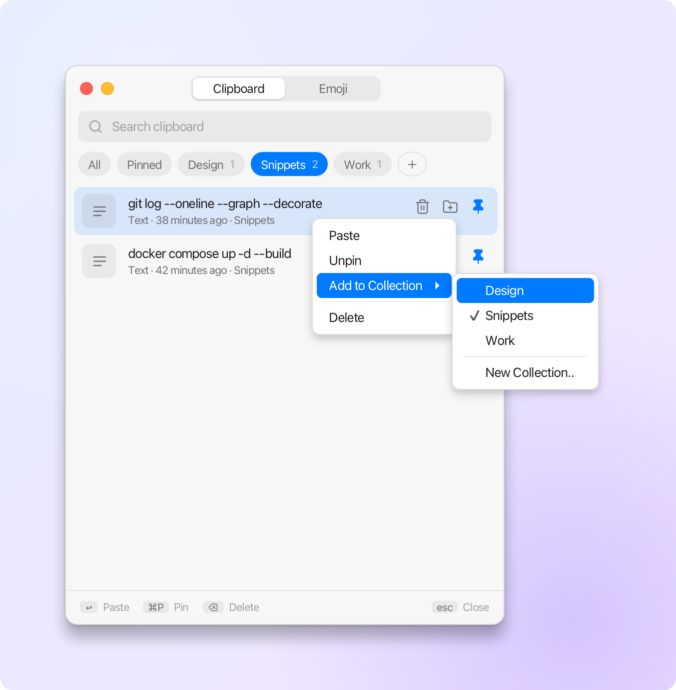
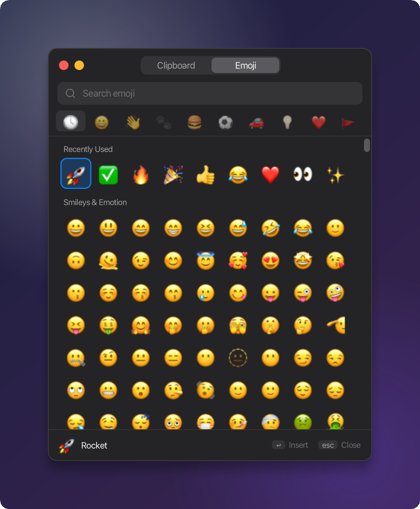
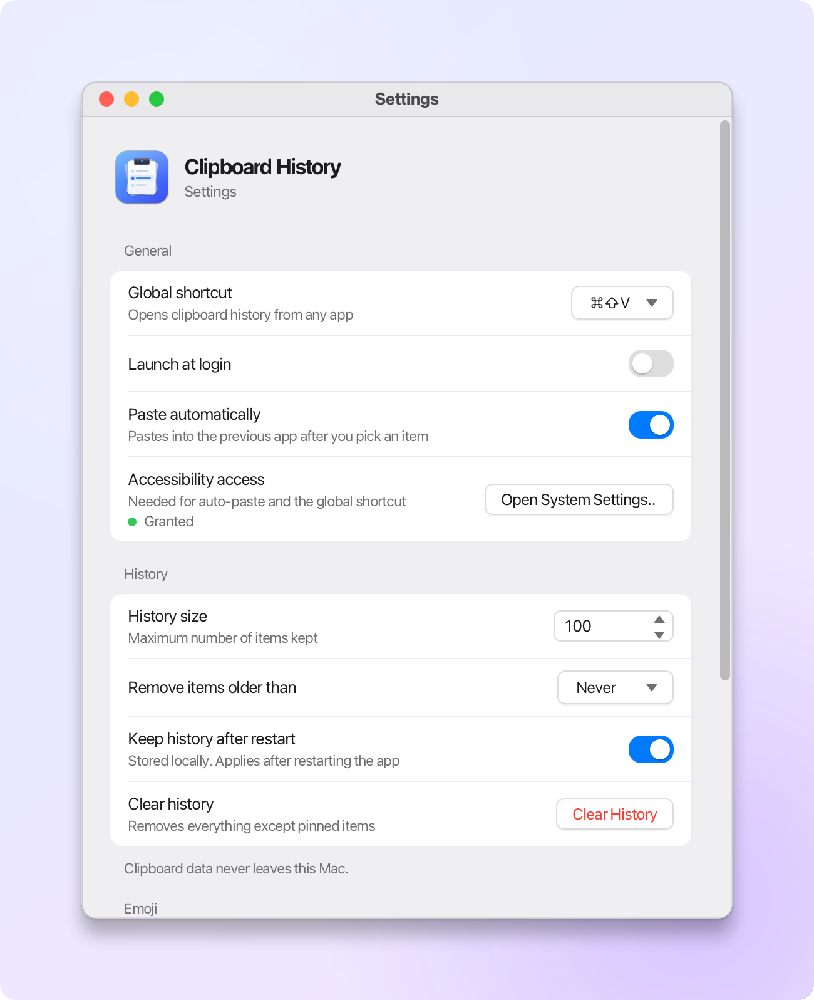

<p align="center">
  
</p>

<h1 align="center">Clipboard History</h1>

<p align="center">
  <b>A fast, private clipboard manager and emoji picker for macOS.</b><br>
  Everything you copy, one keystroke away.
</p>

<p align="center">
  
  
  
  <a href="LICENSE"></a>
</p>

<p align="center">
  
</p>

Press **⌘⇧V** in any app and your clipboard history appears right under the pointer.
Pick an item and it is pasted straight back into what you were doing. Pin the things you
reuse, sort them into collections, and find anything with a quick search. An emoji
picker lives in the same window. Everything stays on your Mac.

## Highlights

- **Instant recall.** Text, rich text, links and images, newest first, with previews and thumbnails.
- **Paste where you were.** Choosing an item puts it back in the app you came from and pastes it for you.
- **Pins and collections.** Keep snippets forever and file them under collections you name yourself.
- **Search as you type.** Filter the whole history, your pinned items, or a single collection.
- **Built-in emoji picker.** 1,900+ emoji with keyword search and recently used favorites.
- **Feels native.** Follows Light and Dark Mode, lives in the menu bar, and is fully keyboard driven.
- **Private by design.** No accounts, no network access, no telemetry. History is a local SQLite file you control.

## Collections

<p align="center">
  <picture>
    <source media="(prefers-color-scheme: dark)" srcset="docs/screenshots/collections-dark.png">
    
  </picture>
</p>

Collections keep the things you reuse organized: code snippets, addresses, brand colors,
canned replies. Give them any name you like.

- Click **+** in the chip row, type a name and press Return.
- Right-click an item, or hover it and click the folder button, then choose a collection.
- Double-click a collection chip to rename it; right-click it to rename or delete.

Filing an item pins it, so it is never removed by the history limit, the retention
period or **Clear History**. Deleting a collection keeps its items as pinned items.

## Emoji picker

<p align="center">
  
</p>

Switch with **⌘2**. Search by name or keyword (`laugh` → 🤣 😄, `fire` → 🔥, `rocket` → 🚀), jump
between categories from the bar, and move around the grid with the arrow keys. The emoji
you use most float to the top.

## Settings

<p align="center">
  <picture>
    <source media="(prefers-color-scheme: dark)" srcset="docs/screenshots/settings-dark.png">
    
  </picture>
</p>

Choose the global shortcut, how much history to keep and for how long, whether to paste
automatically, launch at login, and whether history survives a restart.

## Keyboard shortcuts

| Keys | Action |
|---|---|
| **⌘⇧V** | Open or close the popup (configurable in Settings) |
| **⌘1** / **⌘2** | Clipboard / Emoji tab |
| **↑** **↓** | Move through the list |
| **↩** or double-click | Paste the selected item |
| **⌘P** | Pin or unpin |
| **⌫** | Delete the selected item |
| **esc** | Clear the search, then close |
| Right-click | Paste, pin, add to a collection or delete |

## Install

Clipboard History is built from source; you need macOS and JDK 21.

```bash
git clone https://github.com/jaggerjack61/MacClipboard.git
cd MacClipboard
./gradlew packageApp                      # builds build/stage/Clipboard.app
cp -R build/stage/Clipboard.app /Applications/
open /Applications/Clipboard.app
```

The app lives in the menu bar (no Dock icon). Click the clipboard icon, or press
**⌘⇧V**, to open it.

### Permissions

Capturing history works without any permissions. Two features need **Accessibility**
access (*System Settings → Privacy & Security → Accessibility*):

1. **The global shortcut.** It listens for ⌘⇧V system-wide through a macOS event tap.
2. **Automatic paste.** Pasting into another app means sending it a ⌘V keystroke.

Settings shows whether access is granted and has a button that opens the right pane.
Without it, choosing an item still copies it, so you can press ⌘V yourself.

> **Tip:** the app is not signed with a developer certificate, so after installing a new
> build macOS may treat it as a different app. If the shortcut stops responding, remove
> Clipboard from the Accessibility list, add it again and relaunch.

To make a distributable DMG:

```bash
jpackage --type dmg --name Clipboard --app-version 1.0.0 \
         --input build/install/clipboard/lib --main-jar clipboard-1.0.0.jar \
         --main-class app.Launcher --dest build/dist \
         --icon packaging/icon.icns \
         --java-options "-Dapple.awt.UIElement=true"
```

## Privacy

- Nothing is ever sent over the network; the app makes no network requests at all.
- History lives in `~/Library/Application Support/Clipboard/clipboard.db`. Turn off
  *Keep history after restart* to keep it in memory only.
- Pause capture from the menu bar at any time, clear history in one click, and set a
  retention period so old items expire.
- Clipboard contents are never written to logs.

---

## Development

Requirements: macOS, **JDK 21**, and the checked-in Gradle wrapper (`./gradlew`
downloads Gradle 8.14 automatically).

```bash
./gradlew run              # start the app (menu bar only)
./gradlew test             # unit tests
./gradlew uiTest           # JavaFX and native checks (needs a desktop session)
./gradlew packageApp       # build/stage/Clipboard.app
```

Development helpers:

```bash
./gradlew -Pdevpopup run     # seeds sample entries and opens the popup
./gradlew -Pdevemoji run     # same, on the Emoji tab
./gradlew -Pdevsettings run  # opens the Settings window
java scripts/GenerateAppIcon.java   # redraws packaging/icon.icns and the in-app icon
```

When running with `./gradlew run`, grant Accessibility to your terminal instead of the app.
“Launch at login” writes `~/Library/LaunchAgents/local.clipboardhistory.agent.plist`, which
opens the packaged app at login; it works best with the app installed in `/Applications`.

Runtime dependencies (resolved from Maven Central at build time):

| Dependency | Purpose |
|---|---|
| OpenJFX 21 (`javafx.controls`, `javafx.graphics`) | UI toolkit |
| `org.xerial:sqlite-jdbc` | Embedded local database |
| `com.github.kwhat:jnativehook` | Global keyboard shortcut (native event tap) |
| `net.java.dev.jna` | AppKit/CoreGraphics calls (focus restore, synthetic paste, appearance) |
| `org.slf4j:slf4j-simple` | Logging |

## How it works

### Global shortcut (`⌘⇧V`)

* `hotkey.GlobalHotkeyService` is the replaceable interface (`register`/`unregister`).
* `hotkey.MacGlobalHotkeyService` uses **JNativeHook** (a native event tap) and matches
  the parsed `ShortcutModifier` from settings. The callback is marshalled onto the JavaFX
  thread with `Platform.runLater`, which toggles the popup.
* Changing the shortcut in Settings re-registers live.

### The popup

* `ui.ClipboardPopupController` creates an undecorated, always-on-top JavaFX `Stage`
  (`StageStyle.TRANSPARENT`) with rounded CSS (`resources/ui/clipboard.css`). `ui.Theme` adds
  `clipboard-dark.css` (token overrides only) when macOS is in Dark Mode, re-checked on every
  show, and `MacNative.refreshWindowShadow` gives the borderless window a native shadow.
* It positions itself centered under the mouse (`positionNearMouse`), clamped to screen bounds.
* It closes when it loses focus or on **Escape**. Selecting an entry also closes it.
* Keyboard: ↑/↓ navigate, **Enter** or double-click selects, **Delete** / **⌫** removes the focused
  item, **⌘P** pins it. Typing while the Emoji tab is open focuses the search field.
* Tab switching: click the tabs, **⌘1** / **⌘2**, or ←/→ when a tab button has focus.
* Collections: `ui.CollectionBar` is the chip row (All, Pinned, one chip per collection, **+**).
  Collections are created and renamed with an inline field rather than a dialog, which would
  take focus and close the popup. An item belongs to at most one collection
  (`clipboard_items.collection_id`); filing pins it, unpinning clears it, and deleting a
  collection leaves its items pinned.

### Clipboard monitoring & history

* `clipboard.AwtClipboardGateway` reads/writes the system clipboard through AWT
  (`Toolkit`, `Clipboard`, `Transferable`, `DataFlavor`) — text, HTML (rich text) and images.
  Image payloads are re-encoded as PNG and a 72 px thumbnail is stored for previews, so
  large screenshots don't bloat memory or the list.
* `clipboard.ClipboardMonitor` polls every 400 ms on a daemon scheduler (the macOS
  clipboard offers no push API for passive observers). It checks the native pasteboard
  change count before reading payloads, so unchanged images are not repeatedly encoded.
* `clipboard.ClipboardService` performs SHA-256 dedupe (identical-to-latest is ignored;
  re-copying an older item moves it to the top), enforces the history limit by evicting the
  oldest non-pinned entries, applies the retention window, and exposes search.
  Retention also runs every minute while idle or paused, and immediately when changed
  in Settings. Clearing history does not recapture the unchanged clipboard.
* Temporary clipboard ownership errors from other apps are caught and retried on the next poll.

### Automatic paste (⌘V)

`paste.MacPasteService` + `platform.MacNative` (JNA → AppKit/CoreGraphics):

1. Before the popup opens, the frontmost application's pid is captured
   (`NSWorkspace.frontmostApplication`).
2. On selection, the popup hides, the item is written to the clipboard, focus is restored
   with `NSRunningApplication.activateWithOptions:`, and
   `CGEventCreateKeyboardEvent`/`CGEventPost` synthesizes ⌘V.
3. All of this runs on a worker thread; if Accessibility is not granted, it silently
   stops at “copied to clipboard”.

### Emoji picker

* `emoji.EmojiRepository` loads `resources/emoji/emojis.tsv` — 1906 fully-qualified
  Unicode emoji (Unicode 16 dataset) with CLDR names, category, and keyword aliases
  merged from gemoji. It is bundled, so **no network access is ever required**.
* Search matches names *and* keywords, ranked exact → prefix → contains:
  `laugh → 🤣 😄`, `heart → 💘 💝`, `fire → 🔥`, `check → ✅`, `rocket → 🚀`.
* Clicking/Enter copies the emoji, records it in `recent_emojis` (SQLite), closes the
  popup and pastes it.
* `RecentEmojiService` ranks recents with a combined frequency + exponential-decay
  recency score, and trims to the configurable maximum.
* Regenerate the dataset (offline, needs the two source files in `scripts/`):
  `python3 scripts/build_emoji_dataset.py`.

### Persistence

* `repository.Database` owns the SQLite connection and applies migrations via
  `PRAGMA user_version` (tables: `clipboard_items`, `collections`, `settings`,
  `recent_emojis`). Upgrades are additive, so existing history is kept.
* WAL mode; clipboard list queries run off the FX thread and fetch only previews and
  thumbnails. Full payloads are loaded on selection; searches are debounced and stale
  results are discarded. The popup reloads on open.
* Turning off “Store clipboard history between restarts” switches to
  `InMemoryClipboardRepository` on the next launch.
* **Nothing is ever sent over the network.** Clipboard data lives only in
  `~/Library/Application Support/Clipboard/`.

### Privacy

* `security.PrivacyService`: global pause switch (tray + settings), oversized-payload guard,
  and an `isIgnoredApp(...)` extension point backed by the configurable ignore list
  (default: 1Password, Keychain, Bitwarden, KeePass) for future source-app filtering.
* Clipboard contents are never written to logs; only types/lengths/hashes are.

---

### Menu bar

`tray.MenuBarService` draws the menu-bar glyph at 1x and 2x as a macOS *template image*
(`apple.awt.enableTemplateImages`), so the system tints it for light and dark menu bars
like native icons. Left-click opens the popup; the menu offers the emoji picker, pause,
clear, Settings and Quit.

## Architecture

```
src/main/java/
  app/         ClipboardApplication (JavaFX wiring), Launcher (classpath-safe entry)
  clipboard/   ClipboardMonitor, ClipboardService, ClipboardHasher, ClipboardGateway,
               AwtClipboardGateway (macOS system clipboard), ClipboardSnapshot
  model/       ClipboardItem, ClipboardPreview, ClipboardCollection, HistoryFilter,
               ClipboardContentType
  repository/  ClipboardRepository + Sqlite/InMemory impls, SettingsStore + Sqlite impl,
               Database (migrations)
  emoji/       Emoji, EmojiCategory, EmojiRepository, EmojiService,
               RecentEmojiService + Sqlite/InMemory repos
  hotkey/      GlobalHotkeyService, MacGlobalHotkeyService (JNativeHook), ShortcutModifier
  paste/       PasteService, MacPasteService
  platform/    MacNative (JNA/AppKit/CoreGraphics/Accessibility), ObjCRuntime, LaunchAtLogin
  ui/          ClipboardPopupController, ClipboardTabController, CollectionBar,
               EmojiTabController, SettingsController, Theme, Icons, Controls, RelativeTime
  tray/        MenuBarService (SystemTray)
  security/    PrivacyService
src/main/resources/
  emoji/emojis.tsv       offline dataset (generated from Unicode 16 + gemoji)
  ui/clipboard.css       theme: light tokens and all rules
  ui/clipboard-dark.css  dark-mode token overrides
  ui/app-icon.png        app icon shown in Settings
scripts/       build_emoji_dataset.py + source data, GenerateAppIcon.java
packaging/     icon.icns
docs/          README icon and screenshots
```

Clipboard access (`ClipboardGateway`), hotkeys (`GlobalHotkeyService`) and paste
(`PasteService`) are interfaces with macOS implementations isolated in `platform/`,
`hotkey/` and `paste/`. Core logic (`ClipboardService`, repositories, emoji services,
settings) is plain Java and unit-tested without a real clipboard.

## Tests

`./gradlew test` covers dedupe, history limits, pinning, collections (naming rules,
filing, deletion, upgrades), deletion, clearing, persistence across reopen, search,
retention, the clipboard monitor, rich-text round trips, emoji search and categories,
recent-emoji ranking, settings persistence, hash stability and shortcut parsing.
`./gradlew uiTest` exercises the Settings window and asynchronous history loading on a
real desktop.

## License

[MIT](LICENSE) © 2026 Samuel Jarai
